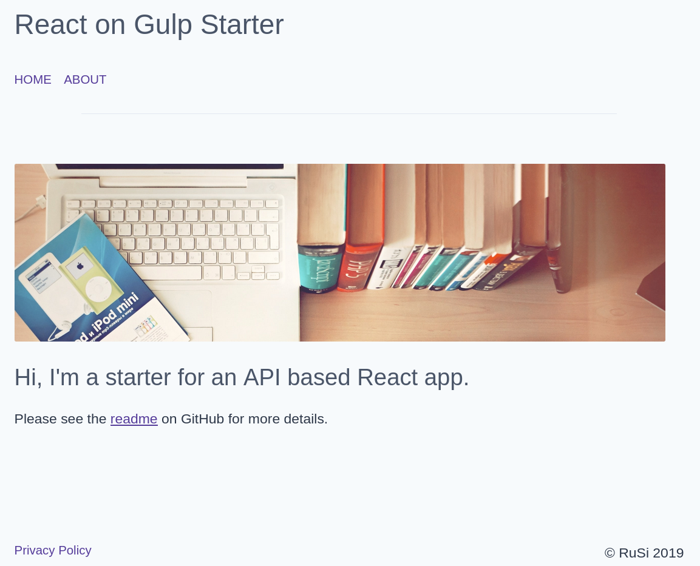

# React on Gulp - Starter 🚀

## Framework

* React
  * Transpilation via Babel
    * Support for `ES2015` JavaScript syntax
    * Support for `async`/`await` syntax
  * Module bundling via Browserify
  * `react-router` for routing
  * `axios` for API calls
* PostCSS
  * Includes: imports, nesting, purge, minification
  * Autoprefixer
  * TailwindCSS, configured to strip out unused classes from production builds
* BrowserSync
* Prettier and editorconfig
* Modular gulp task files for easy configuration and modification

## How to Use

### Local Development

* `nvm use`
* `npm install`
* `npm run dev`
* Open `localhost:3000` on your browser

### Production

* `npm run build`
